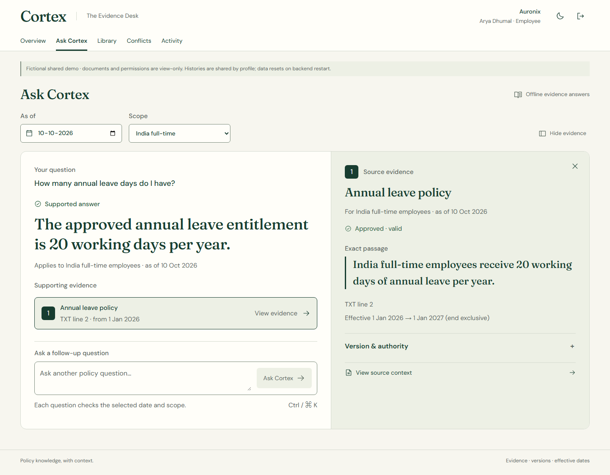

# Cortex AI

Conflict-aware, permission-safe enterprise knowledge intelligence for a final-year BTech Computer Science project.

**Phase 3: evidence core and full-product UI, production demo verified 2026-10-10.** Phase 1 research and Phase 2 architecture/design are owner-approved and preserved. This checkpoint is a bounded offline policy answerer: reviewed numeric claims for annual leave, remote work, notice period and executive bonus. It is not yet a general-purpose LLM chatbot or a production enterprise deployment. No paid API is required or enabled.

Company knowledge can be relevant but outdated, conflicting or inaccessible. Cortex checks current identity and explicit document grants, approval, effective date and scope before reading evidence for reasoning. It then compares source authority and either produces an exact cited evidence answer or abstains. Newest upload does not imply currently effective policy.

Repository: [NoirPrimordial7/cortex-ai](https://github.com/NoirPrimordial7/cortex-ai), `main`. GitHub currently reports **PUBLIC**; the repository was created private in Phase 1. This task did not change visibility or collaborators. Local database, uploaded files and generated credentials are excluded from Git.

## Run and inspect

**Live shared demo: https://cortex-ai-three-kappa.vercel.app** — choose a fictional profile, then click Enter your workspace. No remembered credentials required.

Fictional profile buttons fill workspace, email and password before normal sign-in. [Shared demo hosting contract](docs/implementation/SHARED_DEMO.md): free Vercel frontend and disposable single-process Render backend; hosted uploads/governance are read-only. Live publication checks are recorded separately from local tests.

**Live development:** http://127.0.0.1:5173 (frontend hot updates; requires the two running local servers).

[PowerShell startup and fictional sign-in instructions](docs/implementation/RUN_LOCAL.md) · [actual module status and limits](docs/implementation/IMPLEMENTATION_STATUS.md) · [test results](docs/implementation/TEST_RESULTS.md) · [backend API contracts](backend/README.md).

Use workspace `NORTHSTAR` and employee `maya@example.test`; generated passwords exist only in ignored `local-data/credentials.json`. Reviewer/admin and auditor accounts demonstrate separate actions and document access. Do not publish that file or use real company data.

## Genuine running UI

**Full-product forest/ivory refinement:** one shell, typography and responsive controls across every route, with compact citations and dedicated mobile evidence. Owner-approved production release includes the Auronix team profiles. [Current PR #8 production screenshots and verification](docs/design/pr8-production-release/README.md); historical visuals remain preserved.

Real browser screenshot of the published React/FastAPI system using fictional data. Current leave evidence is20 days; historical2025 evidence is18; equally authoritative remote-work policies produce an abstention with both citations. These values come from the provided fixture and API, not hardcoded frontend answers.

[Running screenshot gallery](docs/design/README.md) includes desktop/tablet/mobile, dark theme, upload/review, version history, permissions, own history and redacted audit. Phase2 concept artwork remains separately labelled. [Design QA](design-qa.md) records actual checks and corrections.

## Implemented stack and modules

| Layer | Actual checkpoint |
|---|---|
| Frontend | React19, Vite7, TypeScript, Tailwind4 with shared original CSS tokens, React Router, Phosphor icons; `package-lock.json` |
| Backend/auth | Python3.12, FastAPI, opaque HTTP-only sessions, Argon2id, Origin/CSRF checks, action roles and explicit document grants |
| Database/retrieval | SQLite/FTS5, SQLAlchemy Core, Alembic; permission-filtered clause IDs, authorized lexical scoring and topic peers |
| Processing/reasoning | pypdf, python-docx, UTF-8 TXT; bounded parser child, trusted review, deterministic interval/authority/conflict rules |
| Verification | Pytest/HTTPX, Ruff, Vitest/RTL, TypeScript production build, live in-app browser checks; exact Python lock |

Backend and UI cover login/session, permitted knowledge dashboard, assistant/citations, document library, private upload, immutable version/detail/download, metadata review, conflict/history inspection, existing-user roles/enable-disable, document grants and sanitized audit activity. Admin action does not bypass READ.

## Architecture actually implemented

One backend application worker serializes protected requests and access changes with an exclusive process gate and one transaction. This is a conservative local deadline trade-off; synchronous parsing may hold the gate for30 seconds. [ADR0005](docs/decisions/0005-local-execution-boundary.md) explains changes from the approved design. [Earlier diagrams](docs/DIAGRAMS.md) remain planning references, not proof that optional AI is implemented.

## Verified progress and remaining work

| Check | Result / scope |
|---|---|
| Backend |39 tests pass, including ingestion/review, direct-resource denial, historical validity and concurrent revocation; one compatibility deprecation warning |
| Frontend |28 tests pass; TypeScript/Vite build succeeds; real responsive screen checks |
| Crafted fixture |12/12 outcomes,15/15 authorized peers,10/10 exact citation spans/hashes; **same development fixture, not held-out accuracy** |
| Public release |62 API assertions, six unique browser scenarios,155 production captures across six widths/both themes,19 exact served asset hashes; [evidence](docs/design/pr8-production-release/README.md) |
| Quality |Ruff/pip consistency pass; npm audit zero findings at this checkpoint; sampled contrast and reflow checked |

No arbitrary40% completion or general accuracy claim is made. Future priorities are a held-out adjudicated corpus, richer clauses/lineage and permitted rejection explanations, parser isolation/denial audit/retention, and measured optional local semantic enhancements. Chunk ACLs, general amendments/exceptions, NLI, vector retrieval, LLM generation, agents, user creation and multiworker/durable production deployment remain unimplemented.

## Preserved research and approved planning

The Phase1 dossier covers13 competitor families,15 academic works and76 primary references, with documentation-based claims and explicit evidence limits. No world-first claim is made. [Documentation index](docs/README.md), [planning backlog](docs/planning/IMPLEMENTATION_BACKLOG.md), [draft future roadmap](docs/PROJECT_ROADMAP.md), [ADRs](docs/decisions/README.md) and [plain-English guides](docs/learning/SYSTEM_EXPLAINED.md) connect plans to current implementation.

## Research documents

- [Research briefing](docs/RESEARCH_SUMMARY.md) and [project overview](docs/PROJECT_OVERVIEW.md)
- [Competitor profiles](docs/COMPETITOR_ANALYSIS.md) and [cited feature matrix](docs/FEATURE_COMPARISON.md)
- [Literature review](docs/LITERATURE_REVIEW.md) and [source register](docs/RESEARCH_SOURCES.md)
- [Research gaps](docs/RESEARCH_GAPS.md) and [proposed improvements](docs/PROPOSED_IMPROVEMENTS.md)
- [Draft roadmap and three scopes](docs/PROJECT_ROADMAP.md) and [observed/proposed architecture notes](docs/ARCHITECTURE_NOTES.md)
- [Quality review](docs/QUALITY_REVIEW.md), [decision policy](docs/decisions/README.md), [changelog](docs/changelog/CHANGELOG.md), [development log](docs/logs/DEVELOPMENT_LOG.md) and [research log](docs/logs/RESEARCH_LOG.md)
- [Paper registry](research/papers/README.md), [competitor registry](research/competitors/README.md), [proposed experiment protocol](research/experiments/README.md), [source inventory](research/SOURCE_INVENTORY.json) and [dated link checks](research/SOURCE_CHECKS.json)

## Long-term traceability

Every meaningful change records ISO 8601 date/time with timezone, phase/module, files added/changed/removed, reason, outcome, verification/tests, outstanding issues and commit reference when available. Update the changelog and relevant chronological log; add an ADR when an actual architecture decision is made. A commit cannot contain its own hash: record it in the next log update or resolve its descriptive subject with Git.

Before each push, inspect staged filenames and diff, check for secrets/confidential content, commit only intended changes, push to the verified remote/branch and compare remote HEAD with local HEAD. Ignore rules are defense in depth and cannot guarantee that a secret is never staged. Never change repository visibility or collaborators without explicit approval.
