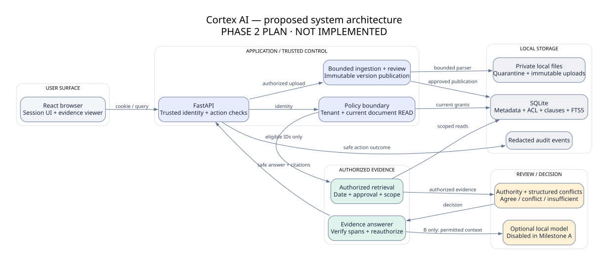
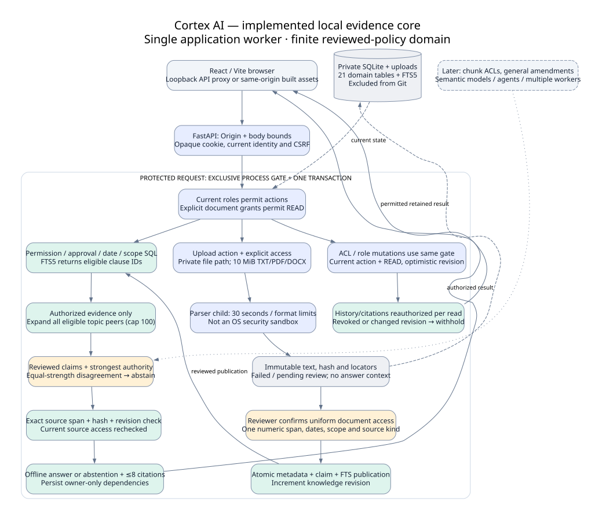

# Visual architecture gallery

**Diagrams01–10 preserve the approved Phase2 plan. Diagram11 describes the implemented Phase3 local core.** Assessment: 2026-10-09. SVG provides scalable GitHub viewing; PNG supports presentations; `.mmd` is editable Mermaid source and `.dot` is a paired editable Graphviz layout. [Manifest](diagrams/MANIFEST.json) records actual export tooling; no fake screenshots or proprietary internals are depicted.

| Diagram | View / editable source | Explanation and example |
|---|---|---|
| Implemented local core | [SVG](diagrams/11-implemented-core.svg) · [PNG](diagrams/11-implemented-core.png) · [Mermaid](diagrams/11-implemented-core.mmd) | Real one-process gate, private parser/review, authorized offline answering and revision-safe reads; absent advanced capabilities explicitly marked. |
| Complete architecture | [SVG](diagrams/01-system-architecture.svg) · [PNG](diagrams/01-system-architecture.png) · [Mermaid](diagrams/01-system-architecture.mmd) | One backend controls identity and evidence. Employee leave question reaches only approved permitted clauses. |
| Application data flow | [SVG](diagrams/02-data-flow.svg) · [PNG](diagrams/02-data-flow.png) · [Mermaid](diagrams/02-data-flow.mmd) | Upload review and querying are separate paths; pending upload is not answer evidence. |
| Retrieval / answering | [SVG](diagrams/03-rag-pipeline.svg) · [PNG](diagrams/03-rag-pipeline.png) · [Mermaid](diagrams/03-rag-pipeline.mmd) | IDs are permission-filtered before text hydration; offline evidence answering is mandatory. |
| Authentication / authorization | [SVG](diagrams/04-auth-permissions.svg) · [PNG](diagrams/04-auth-permissions.png) · [Mermaid](diagrams/04-auth-permissions.mmd) | Login establishes identity; explicit document grants authorize content. Hidden objects produce generic unavailable response. |
| Database relationships | [SVG](diagrams/05-database-erd.svg) · [PNG](diagrams/05-database-erd.png) · [Mermaid ERD](diagrams/05-database-erd.mmd) | Identity, evidence lifecycle and citation dependencies connect through tenant-safe keys. Full constraints are in the schema document. |
| Upload / versioning | [SVG](diagrams/06-ingestion.svg) · [PNG](diagrams/06-ingestion.png) · [Mermaid](diagrams/06-ingestion.mmd) | Immutable text, protected review, atomic publication; failed extraction never becomes searchable. |
| Temporal / conflict reasoning | [SVG](diagrams/07-temporal-conflict.svg) · [PNG](diagrams/07-temporal-conflict.png) · [Mermaid](diagrams/07-temporal-conflict.mmd) | A future-effective policy is excluded; equal valid authoritative disagreements cause abstention. |
| API request sequence | [SVG](diagrams/08-api-sequence.svg) · [PNG](diagrams/08-api-sequence.png) · [Mermaid sequence](diagrams/08-api-sequence.mmd) | Authenticate → authorized retrieval → reasoning → recheck → answer; changed access discards result. |
| Frontend sitemap | [SVG](diagrams/09-sitemap.svg) · [PNG](diagrams/09-sitemap.png) · [Mermaid](diagrams/09-sitemap.mmd) | Pages expose allowed tasks; route hiding is UX, backend remains the security boundary. |
| Local development / demo | [SVG](diagrams/10-local-deployment.svg) · [PNG](diagrams/10-local-deployment.png) · [Mermaid](diagrams/10-local-deployment.mmd) | Loopback Vite proxy for development; same-origin built assets for demo; AI endpoint optional. |

Color legend: blue application/trusted control; teal authorized evidence; amber governance/decision; pale grey storage or user surface. Every flow arrow is directional; relationship labels explain cardinality. Diagrams intentionally simplify fields and rejection details; [schema](planning/DATABASE_SCHEMA.md), [security](planning/SECURITY_MODEL.md), [pipeline](planning/RAG_PIPELINE.md) are normative.

One company policy question passes through explicit checks; optional AI cannot grant itself document access.

## Implemented execution boundary

ADR0005 replaces planned fine reader/writer execution with one exclusive process gate. This diagram records the actual synchronous parser and one-span reviewed claim limits; optional AI/agents/multiworker are future boxes.
