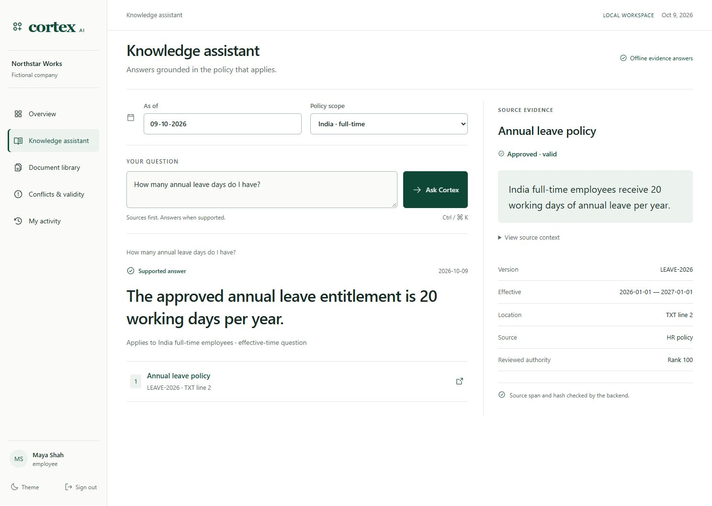
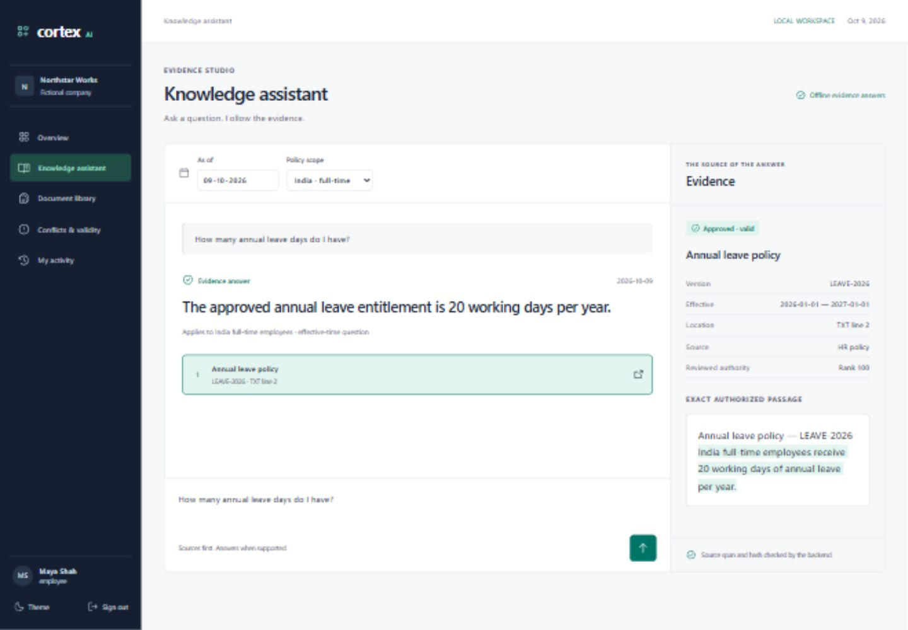
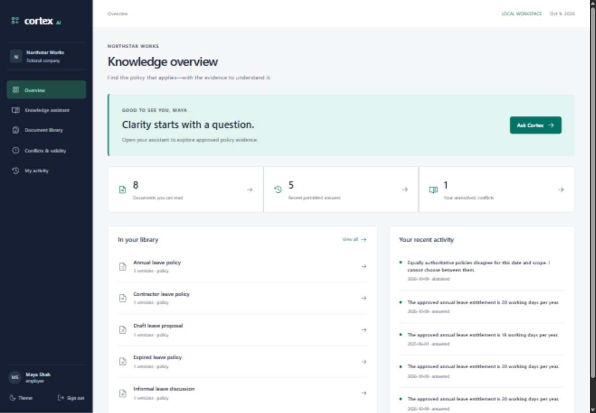
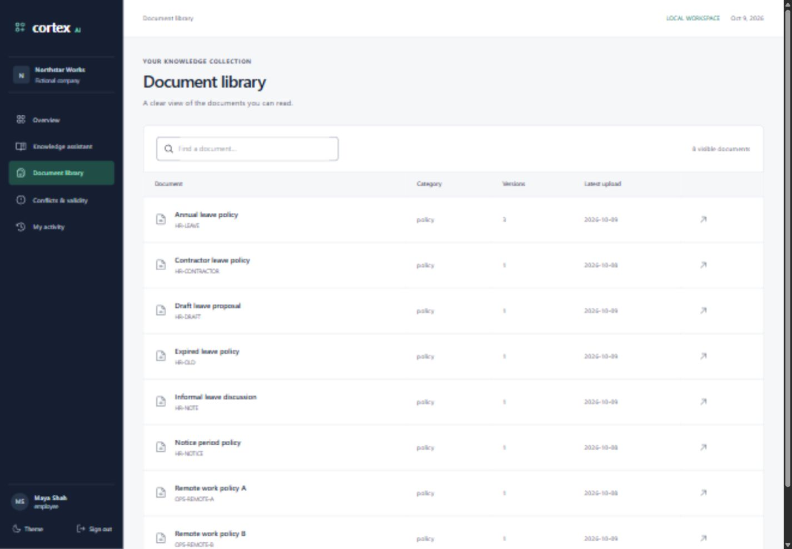
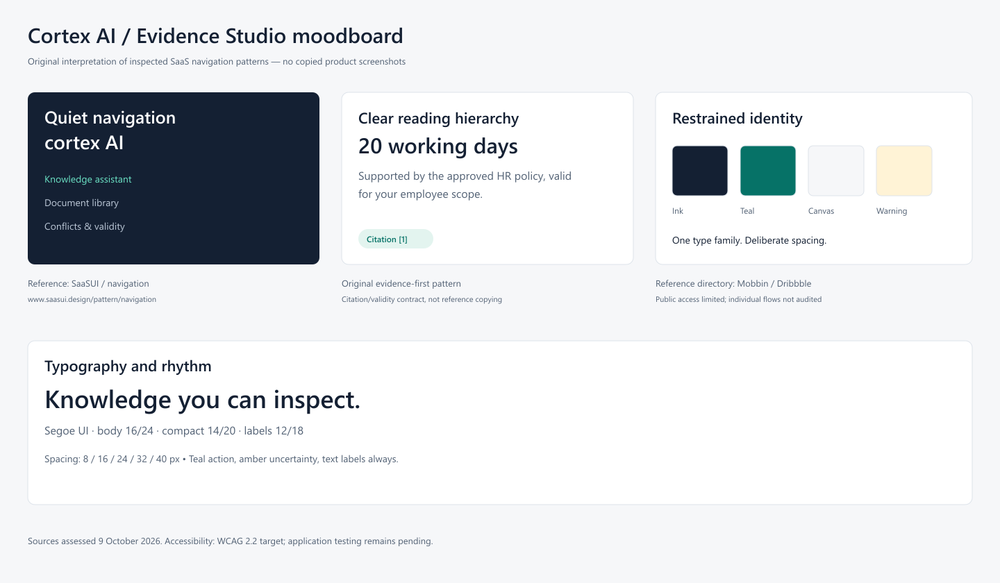
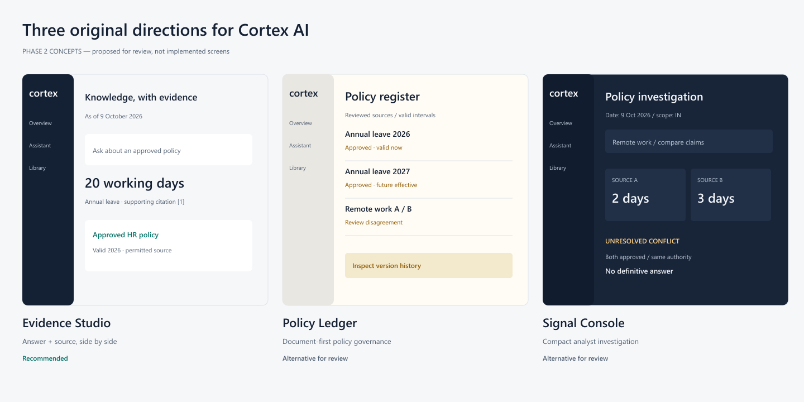
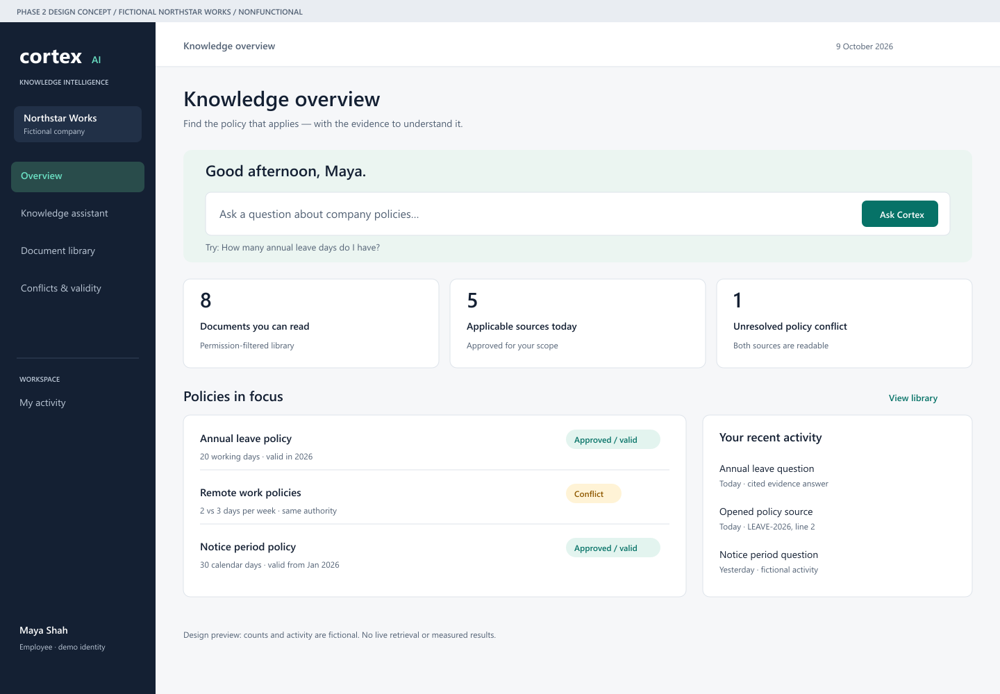
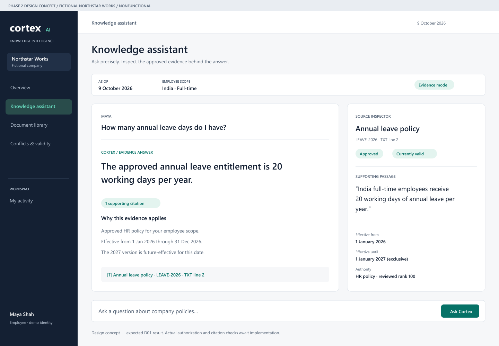
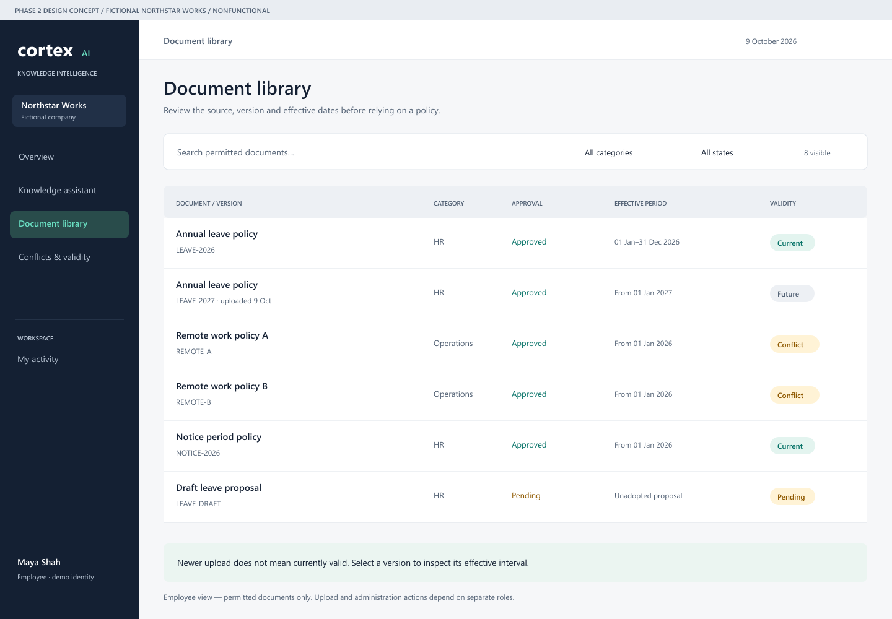

# Cortex AI design gallery

**Current draft PR #8:** the complete forest/ivory visual direction is approved. [Enterprise reader and focused conflict review](premium-refinement/reader/README.md) includes 70 new genuine captures, exact-source reading, same-record conflict comparisons and final release gates. [Open review gallery](premium-refinement/reader/gallery.html). Production is unchanged by this draft; merge/deployment await separate release approval.

**Current full-product review:** [Issue #4 report and pass/pending matrix](product-audit/README.md), [652 real before/after screenshots](product-audit/gallery.html), [verification checkpoints](product-audit/verification.md). The owner locked forest/ivory Fieldbook with editorial refinement. All routes are unified on the review branch; main and production remain unchanged pending approval.

## Historical explorations and earlier implementations

**Evidence Desk exploration (draft PR #2):** [three new desktop/mobile concepts and current-flow findings](evidence-desk/README.md), [project-local skill installation and pins](evidence-desk/SKILL_INSTALLATION.md). These are historical concept artwork. The subsequent Fieldbook selection and full-product implementation are documented above.

**Earlier Atlas Professional refinement:** the owner selected displayed option1 and requested a more professional premium treatment. [Actual new gallery and comparison](redesign/implemented/README.md), [selected revised source](redesign/concepts/atlas-professional.png), [research and baseline](redesign/REDESIGN_BRIEF.md), [current QA](../../design-qa.md).

## Preserved earlier Phase3 gallery

**Current Phase3 running gallery.** These JPEGs are genuine in-app browser captures of the implemented React/FastAPI application with fictional data. The Phase2 concept gallery below remains artwork, separately labelled; its localhost limitation applied then, not to this successful browser session.

| Running screen/state | Desktop | Tablet | Mobile |
|---|---|---|---|
| Login | [1440](screenshots/login-1440.jpg) | [1024](screenshots/login-1024.jpg) | [390](screenshots/login-390.jpg) |
| Assistant/evidence | [1440](screenshots/assistant-answer-1440.jpg) | [1024](screenshots/assistant-answer-1024.jpg) | [390](screenshots/assistant-answer-390.jpg) |
| Dashboard | [1440](screenshots/dashboard-1440.jpg) | [1024](screenshots/dashboard-1024.jpg) | [390](screenshots/dashboard-390.jpg) |
| Library | [1440](screenshots/library-1440.jpg) | [1024](screenshots/library-1024.jpg) | [390](screenshots/library-390.jpg) |
| Version detail | [1440](screenshots/document-detail-1440.jpg) | [1024](screenshots/document-detail-1024.jpg) | [390](screenshots/document-detail-390.jpg) |
| Upload | [1440](screenshots/upload-1440.jpg) | [1024](screenshots/upload-1024.jpg) | [390](screenshots/upload-390.jpg) |
| Trusted review form | [1440](screenshots/review-form-1440.jpg) | [1024](screenshots/review-form-1024.jpg) | [390](screenshots/review-form-390.jpg) |
| Conflicts | [1440](screenshots/conflicts-1440.jpg) | [1024](screenshots/conflicts-1024.jpg) | [390](screenshots/conflicts-390.jpg) |
| Permissions/people | [1440](screenshots/permissions-1440.jpg) | [1024](screenshots/permissions-1024.jpg) | [390](screenshots/permissions-390.jpg) |
| Own history | [1440](screenshots/history-1440.jpg) | [1024](screenshots/history-1024.jpg) | [390](screenshots/history-390.jpg) |
| Sanitized audit | [1440](screenshots/audit-1440.jpg) | [1024](screenshots/audit-1024.jpg) | [390](screenshots/audit-390.jpg) |

[Dark assistant](screenshots/assistant-dark-1440.jpg) and [conflict answer](screenshots/assistant-conflict-1440.jpg) show actual additional states. Earlier extra assistant captures may precede the final font/rank refinement. Counts/history are real permitted data at capture time, not fixed demo analytics.

[Browser measurements](browser-checks.json), [selected computed contrast](contrast-results.json), [design QA](../../design-qa.md), [actual test scope](../implementation/TEST_RESULTS.md).

---

## Preserved Phase 2 baseline

**Phase2 design concepts · fictional Northstar Works · no functional application.** The proposed Evidence Studio direction is awaiting owner review.

The original moodboard combines restrained navigation, typography, palette and evidence-first reading patterns. Reference access/evidence limits are recorded in [design research](DESIGN_RESEARCH.md).

Evidence Studio, Policy Ledger and Signal Console explore different visual hierarchies. These are original concept panels, not screenshots copied from products.

## Priority high-fidelity concepts

Dashboard introduces the ask workflow and only permitted fictional knowledge counts.

Assistant keeps the requested date, employee scope, supported answer and exact source quote together.

Library distinguishes future, current, expired and pending states without treating newest upload as valid policy.

## Editable sources and supporting documents

- [Static HTML/CSS preview landing page](mockups/index.html), [dashboard source](mockups/dashboard.html), [assistant source](mockups/assistant.html), [library source](mockups/library.html), [CSS](mockups/design.css). Controls are nonfunctional by design; GitHub renders source rather than hosting HTML.
- [SVG concept sources](assets/), [mobile adaptations](previews/mobile-adaptations.png), [secondary wireframes](previews/wireframes.png).
- [Design research](DESIGN_RESEARCH.md), [design system](DESIGN_SYSTEM.md), [component contracts](UI_COMPONENTS.md), [journeys](USER_JOURNEYS.md), [wireframes](WIREFRAMES.md), [review/limitations](UI_REVIEW.md).

PNG previews are rendered SVG concept artwork, **not browser screenshots of a running product**. Local browser preview verification unavailable; owner declined headless rendering. No Phase3 app was started.
