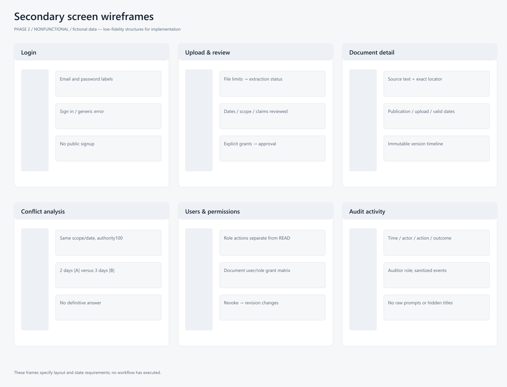
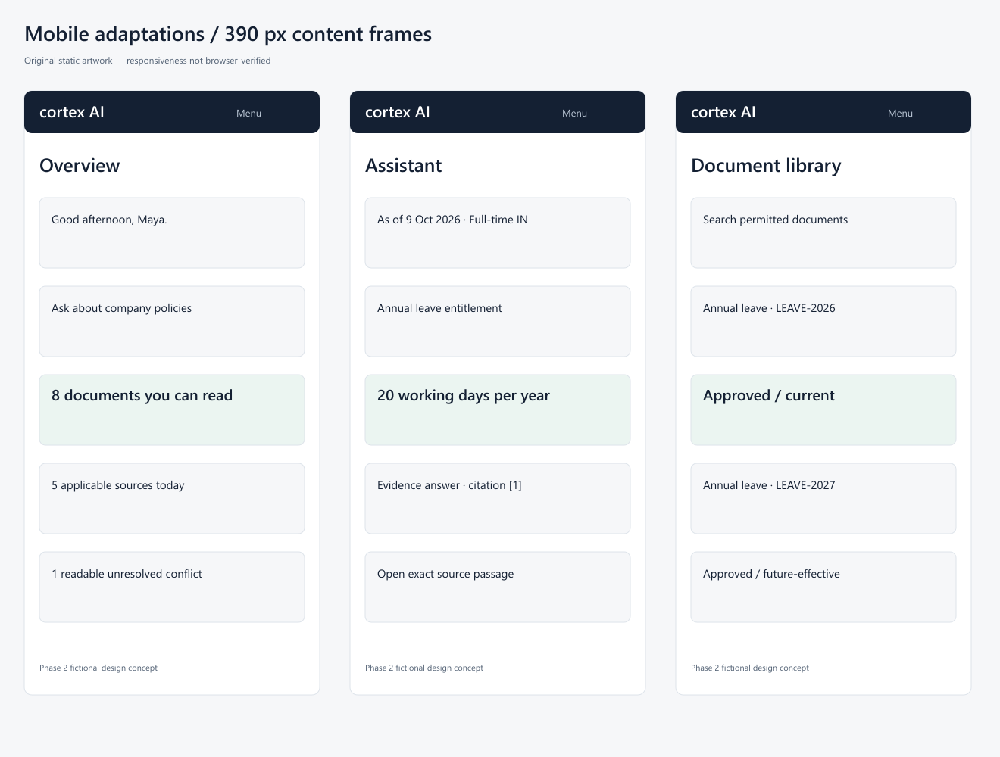

# Wireframes and responsive layouts

**Lower-fidelity planning screens; controls are not functional.** [Wireframe board](previews/wireframes.png) covers login, upload, document detail/version history, conflict analysis, user permissions and audit activity. The three priority screens have [high-fidelity concepts](README.md).

| Screen | Required structure |
|---|---|
| Login | Wordmark, email/password labels, sign-in/error/loading, no public signup |
| Upload | File/limits, extraction stepper, pending review metadata and grant summary |
| Detail/history | Exact text viewer + metadata, publication/ingestion/effective dates, immutable version timeline |
| Conflict | Scope/date header, two permitted evidence spans, unresolved status, governed review link |
| Users/permissions | User roles/actions separate from per-document READ grants, revoke/save review |
| Activity | Sanitized time/action/actor/outcome list; no source text/raw prompts |

Mobile390 stacks dashboard metrics vertically, assistant answer→citation drawer and document library labeled rows; compact navigation opens a drawer. Dates/scopes wrap and remain visible. Tablet uses narrower navigation/evidence drawer. Static source has responsive CSS; local browser layout verification was unavailable and owner declined headless fallback. Actual horizontal overflow/focus behavior must be measured Phase3.
