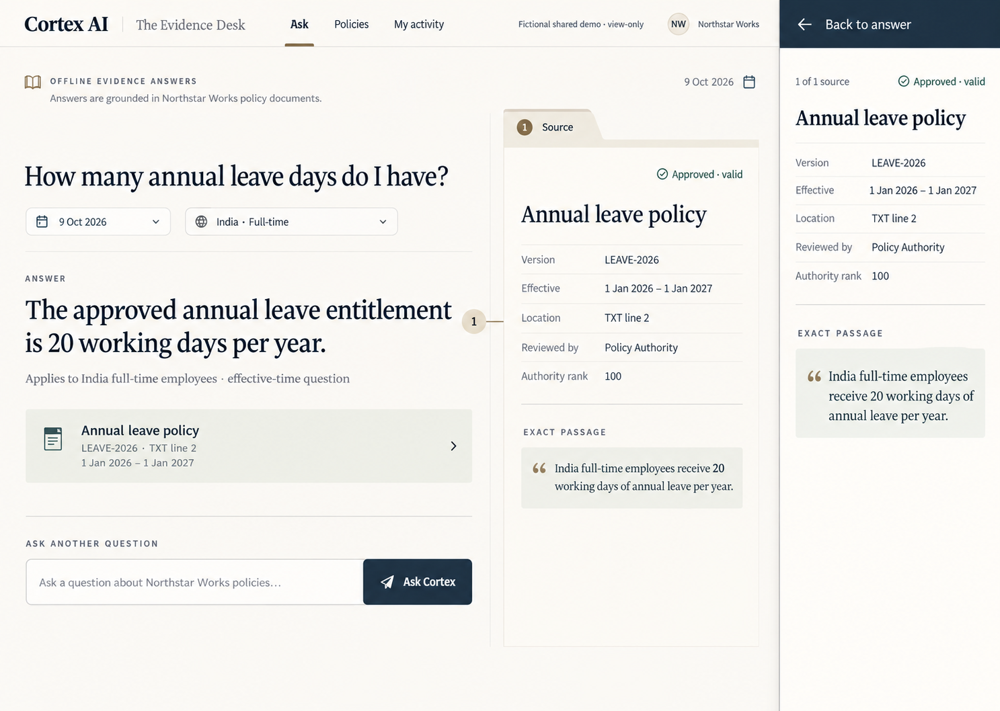
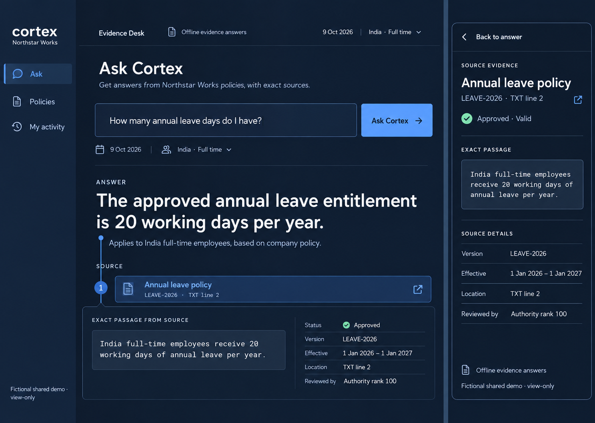
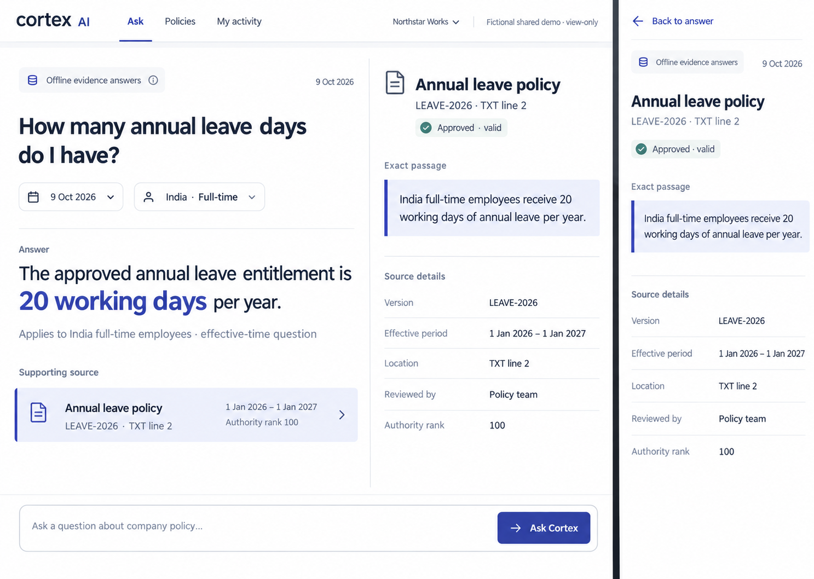

# Evidence Desk: visual selection checkpoint

2026-10-09, Asia/Calcutta. Four curated project skills are locally installed; fresh-session discovery is pending. [Installation and exact pins](SKILL_INSTALLATION.md). The existing design preparation branch and draft [PR #2](https://github.com/NoirPrimordial7/cortex-ai/pull/2) are used, preserving the current deployed Atlas Professional UI.

These are three independent Image Gen mockups, displayed in this order in the current chat. Each explores one desktop assistant and its companion mobile evidence view. These are artwork, not screenshots of a new app; generated type sizes and viewport dimensions are approximate. Actual 320/390/768/1280/1440 behavior, dark mode and accessibility need implementation and testing.

| Displayed choice | Concept | Hierarchy and interaction |
| --- | --- | --- |
| 1 | [Reference House](concepts/reference-house.png) | Top masthead, editorial answer, adjacent document folio, lower composer; mobile source reads as a focused policy page. |
| 2 | [Signal Room](concepts/signal-room.png) | Dark technical workspace, slim rail, upper composer, answer connected to a horizontal passage/metadata lens; mobile source prioritizes the passage. |
| 3 | [Precision Desk](concepts/precision-desk.png) | Compact top navigation, moderately dense answer/document split, lower workbar, quote before grouped source details; mobile source is a compact reading route. |

All concepts use the same fictional Northstar annual-leave example: 20 working days, India full-time, LEAVE-2026, TXT line 2, effective 2026-01-01 through 2027-01-01, authority rank 100. They preserve offline-evidence and shared-demo labeling in the brief. [Prompt grounding](PROMPT_BRIEF.md) records the common input and intended direction differences.

## Implementation corrections and gate

The generated artwork added reviewer identities such as “Policy Authority” and “Policy team.” The existing citation API does not supply those identities; omit those rows in implementation. Show only API-backed reviewed authority rank, approval, dates and scope. A mockup cannot establish contrast compliance, tap-target dimensions, source integrity, focus behavior or performance. The desktop baseline screenshot is visibly soft; rely on DOM text for exact content and recapture at higher fidelity when comparing implementation.

Keep the focused mobile source's explicit Back to answer action, keyboard focus management/restoration, answer scroll preservation and permitted-source invalidation. Sources must remain hidden until an authorized response succeeds. Conflict/abstention statuses must remain truthful; never map a conflict to Approved · valid simply to match the artwork.

Owner selection of a displayed concept is pending. Do not implement a broad new direction or deploy before selection. Then extract tokens, implement assistant/source interaction first, extend the chosen language to existing routes, run meaningful existing/new regression tests and the specified browser/performance checks. No source or dependency changes were made at this checkpoint.

## Current-flow capture and findings

1. **Desktop supported answer — readable, weak differentiation.** At 1440×1024 the current answer and exact permitted passage appear together; generous structure and conventional sidebar dominate the identity. [Current desktop capture](baseline/assistant-1440.jpg).
2. **Phone answer — task requires a long reading stack.** At 390×844 context, question composer and answer precede the source. [Phone before citation](baseline/assistant-390-before.jpg).
3. **Phone citation tap — source loads, focus transition needs improvement.** Clicking the real annual-leave citation retains focus on the citation button. After click, the source container begins at y=487.48 in the viewport, page scrollY=536. There is no focused source route or labeled Back to answer control. The source does load the expected exact quote. [Loaded source capture](baseline/assistant-390-citation-loaded.jpg); [intermediate loading capture](baseline/assistant-390-citation.jpg) is retained as a loading-state record, not a completed-source screenshot.

Observed mobile document width did not overflow at 390px. This is one flow in one viewport, not a complete reflow/accessibility/security audit. Hardware keyboard, screen reader, text zoom, both themes, 320px and conflict flows remain unchecked in this capture pass. Existing authenticated fictional profile was reused; credentials were neither read nor recorded. Asking the sample question adds a permitted event to the shared fictional profile's history.
