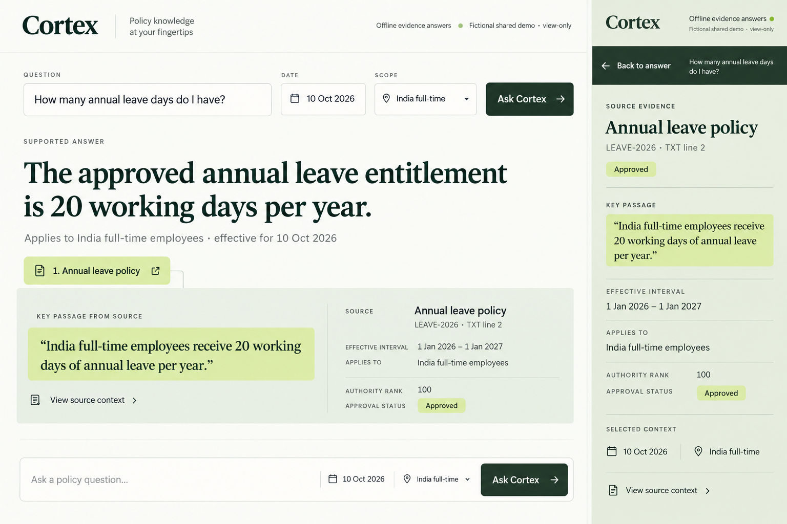
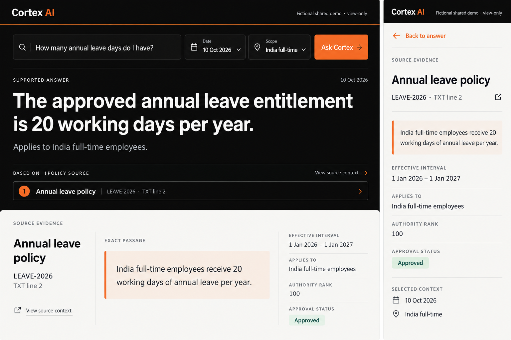
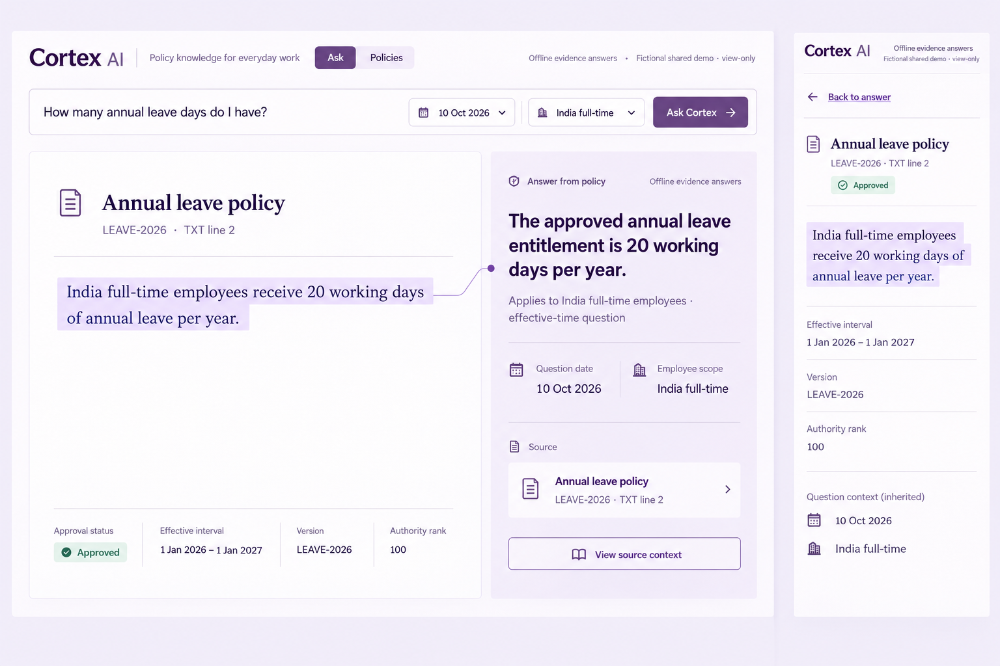
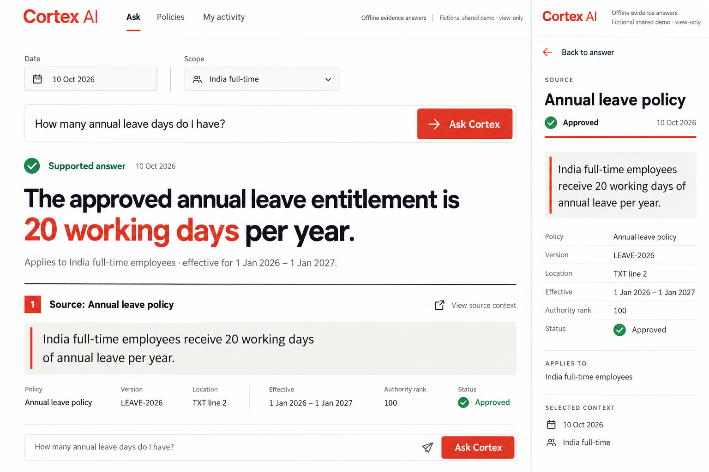
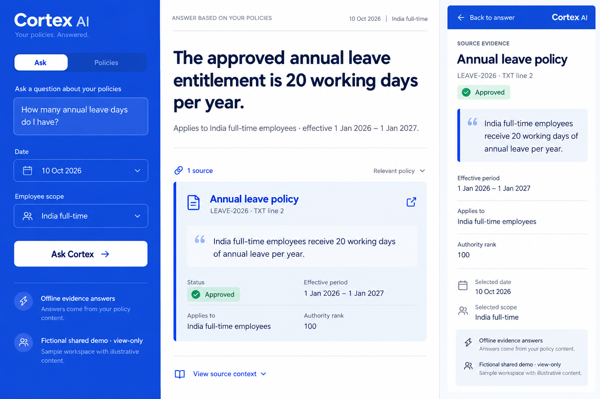
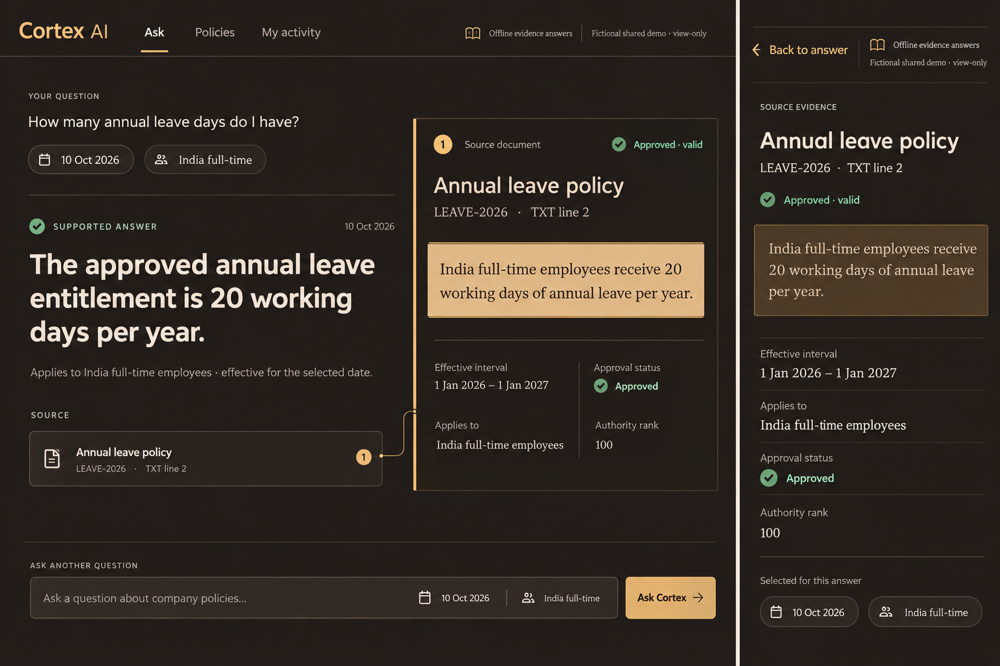

# Evidence Desk: six new directions

2026-10-10, Asia/Calcutta. The owner rejected the first three concepts and requested five to six new ideas. This second set contains exactly six independently generated concepts. Selection numbers refer exclusively to the six images displayed in this round, in the order below. No design has been selected or implemented.

| Displayed choice | Concept | Primary composition |
| --- | --- | --- |
| 1 | Cortex Fieldbook | Sage/olive research desk, broad answer with a wide source strip beneath. |
| 2 | Carbon Evidence | Black/white industrial workspace, strong white evidence dock below the answer. |
| 3 | Margin Intelligence | Lilac source-first reader, answer appears as an annotation alongside the highlighted passage. |
| 4 | Redline Dossier | Vermilion/white typographic dossier, one continuous answer-and-source reading flow. |
| 5 | Cobalt Queryroom | Saturated blue question workspace, continuous white answer/source reader. |
| 6 | Amber Archive | Warm dark reading spread, connected amber-highlighted source and restrained lower composer. |

These are generated artwork, not running app screenshots or responsive/accessibility proof. Each pairs desktop and a focused mobile source reader. Requested canvas 1536×1024; generated dimensions and font rendering are approximate. Current-date anchor 2026-10-10. The attached existing browser screenshots ground the workflow and exact policy facts; they were captured on 2026-10-09 and do not constitute a fresh audit of today's app.

All concepts use the same fictional annual-leave question and permitted exact passage. Source metadata is LEAVE-2026, TXT line 2, effective 2026-01-01 through 2027-01-01, authority rank 100, India full-time. The intended phone interaction opens focused evidence and returns to the prior answer with restored focus and position. Auth, scope/date, revocation, exact citation and conflict behavior remain invariants.

## Required corrections after selection

- Carbon Evidence omitted the mandatory Offline evidence answers label from the artwork. Add it visibly to both surfaces during refinement/implementation.
- Cortex Fieldbook and Redline Dossier repeat the composer in their artwork. Choose one reachable composer; duplicate controls are not a proposed new feature.
- Margin Intelligence has a contained outer panel despite the requested continuous app surface. Remove gratuitous enclosing framing when refining the chosen composition. Other frame/border choices remain visual exploration, not fixed component contracts.
- Generated dimensions, wording, perceived touch-target size, contrast and source validity indicators need real implementation checks. Approval and effective validity are distinct backend concepts; conflict/abstention states must not reuse a generic Approved badge. No artwork adds backend capability or reviewer identity.

Installed skills are now confirmed discoverable in the 2026-10-10 turn's available-skills catalog: frontend-design, web-design-guidelines, vercel-react-best-practices and vercel-composition-patterns. No new installation was needed.

Selection is pending. The deployed UI, application source, package manifests and security/retrieval behavior were not changed. Existing tests/build were last run at the prior checkpoint; no fresh runtime verification is claimed for this artwork-only iteration.
