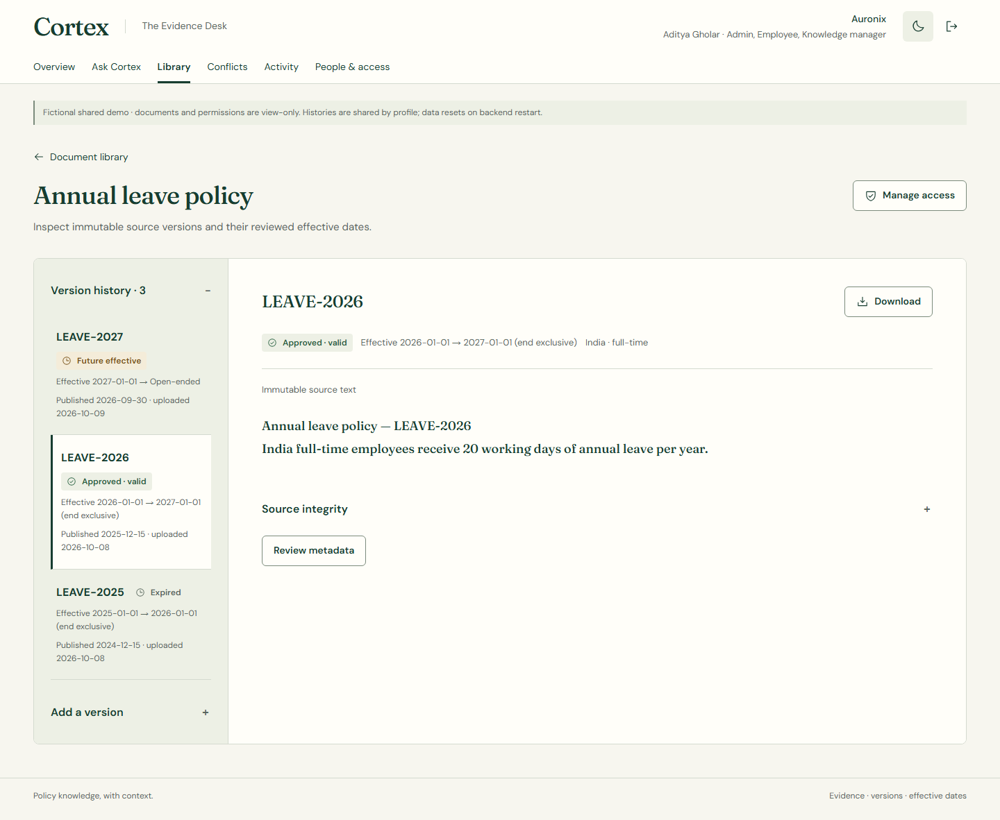

# PR #8 production release: approved workspace, restored documents

10 October 2026. The owner explicitly approved publishing the latest restored version. [PR #8](https://github.com/NoirPrimordial7/cortex-ai/pull/8) merged at `b87a5deb75cd77692409952c13c2687b4ad7d09e`. Screenshot review caught four incorrectly encoded conflict metadata separators; the display-only correction and production regression test are application source `22cbeef46ae6c78112993c1e0fa6f4e33bdbcb11`. Both Vercel READY/production and Render Live publish this application source. [Provider record](deployment-verification.json), [actual Render dashboard](render-live.jpg).

**Live: [Cortex AI](https://cortex-ai-three-kappa.vercel.app).** The complete approved forest/ivory workspace, integrated evidence, loading-state separation, private drafts and keyboard behavior are released. Compact Document Details and Source Inspector, the original fictional corpus, exact source text and backend contracts are restored. The rejected large enterprise corpus/A4 reader/PDF renderer are absent from this release. The architecture diagram remains accurate because no backend architecture changed.

Authorized conflicts group by complete source/version/clause/hash/offset/authority/scope/date identity. The currently permitted latest-30 history contract is unchanged; every occurrence remains inspectable with its original ID/timestamp, and opening a comparison rechecks both sources. Source jumps and return-to-list restore keyboard focus. The public comparison matrix verifies four recorded occurrences remain available in one group, with exact source quotes and SHA256 hashes. The retained [local before/after comparison](../premium-refinement/conflicts/gallery.html) used a different five-record baseline; its layout-height reductions are not claimed as production timings or identical production geometry.

| Verification | Result and scope |
|---|---|
| Fresh preflight | 28 frontend unit tests, 39 backend tests, conflict browser regression, Ruff, TypeScript/Vite and changed-file Prettier pass. Existing Starlette/httpx deprecation warning remains. The restored application previously passed 35 Chromium fixture scenarios and four local browser checks. |
| Final public API | 62 assertions pass: normal sign-in/session/logout, current leave20/historical18, future-version exclusion, exact citation offset/hash, two-source conflict abstention, missing/restricted evidence abstention, tenant denial, wrong Origin/CSRF denial, disabled sign-in denial and hosted write denial. [Sanitized record](hosted-smoke.json). |
| Final public browser | Six unique Chromium scenarios pass through normal public authentication, without API mocks or protection bypass: all five profiles/route guards and authorized conflict grouping. The comparison scenario was repeated with explicit theme readiness before retaining final screenshots. |
| Actual production captures | 155 PNGs and154 geometry observations across320/390/768/1024/1280/1440 and both themes, zero horizontal overflow/clipped visible controls. Ten comparison captures cover1440/1280/768/390/320 in both themes.18 representative PNGs are tracked here; all originals remain in ignored `outputs/pr8-release-final`. [Full measurements and image hashes](browser-verification.json). |
| Exact served build | All19 JavaScript/CSS assets match the final local build byte-for-byte by SHA256. Entry JS96.40kB gzip; CSS10.13; Ask5.17; SourceInspector1.10; DocumentDetails4.84; Conflicts2.54. No reader/PDF chunks or new dependencies. [Asset record](asset-verification.json). |

## Real production document and conflict screenshots

| Width | Restored documents | Authorized comparison |
|---|---|---|
|1440|[Light](document-light-1440.png) · [Dark](document-dark-1440.png)|[Light](conflicts-light-1440.png) · [Dark](conflicts-dark-1440.png)|
|390|[Light](document-light-390.png) · [Dark](document-dark-390.png)|[Light](conflicts-light-390.png) · [Dark](conflicts-dark-390.png)|
|320|[Light](document-light-320.png) · [Dark](document-dark-320.png)|[Light](conflicts-light-320.png) · [Dark](conflicts-dark-320.png)|

[Ask1440](ask-answer-light-1440.png) · [Ask dark390](ask-answer-dark-390.png) · [Focused mobile evidence](evidence-390.png) · [Login320](login-light-320.png) · [Library light390](library-light-390.png) · [Library dark390](library-dark-390.png).

## Boundaries

Exact approved Origins, authentication, tenant/document grants, temporal evidence, abstention and hosted read-only boundaries are unchanged. Backend/app and DocumentDetail/SourceInspector/SourcePassage/Assistant/types are checked identical to approved `2085747`. No live permission, protection, hosting plan or credential change was made. Render's existing Free service remains disposable: a deploy restarts sessions/shared fictional history; it is not durable enterprise storage.

These tests do not certify native Safari, physical phones, soft keyboards, assistive technology, field INP, cold starts, held-out accuracy or continuous monitoring. Gzip payload sizes are not API/CDN latency or Core Web Vitals. Initial release screenshots exposed metadata encoding and a capture-test theme-readiness race; both were corrected before retaining the final evidence. The theme race affected screenshot capture, not the application's theme control.

The following evidence/test-only commit uses `[skip render]`, as in the existing hosting contract, to preserve the verified backend and avoid another disposable data/session reset. Application source remains22cbeef; Vercel can build that evidence commit automatically. Deployment status and the public alias are rechecked after the push. Browser traces, credentials, cookies, databases and uploaded files are excluded from Git.
