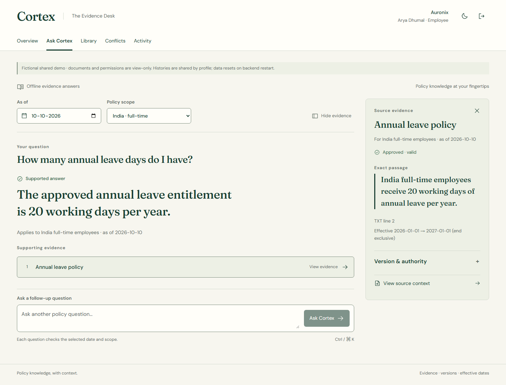

# Verified full-product production release

10 October 2026, Asia/Calcutta. The owner explicitly requested all code be pushed and the application published. [PR #6](https://github.com/NoirPrimordial7/cortex-ai/pull/6) merged at `fc8444f`; the final Audit rendering correction is application source `3834cda4d224784354610efb9f49cd3604454012`. Both providers published that source: Vercel READY/production and Render Live. [Provider record](deployment-verification.json), [actual Render dashboard](render-live.jpg).

**Live application: [Cortex AI](https://cortex-ai-three-kappa.vercel.app).** Choose Arya Dhumal (employee), Aditya Gholar (reviewer/admin), Ashwin Gudur (auditor), or Yashraj Bansal (other tenant), then enter the workspace. The disabled test account deliberately fails. Existing account IDs, emails, passwords, tenants and roles are preserved.

The shared forest/ivory design now covers login, overview, Ask/citations, library/document detail, upload/review, history, conflicts, people/permissions and audit. One shell and semantic stylesheet replace inconsistent overlays. Ask uses compact citations, a collapsible desktop inspector, focused mobile evidence and a persistent follow-up composer. Final production inspection found an Audit row-rendering optimization causing blank offscreen rows in document captures; removing it restored complete records, then local and production checks passed again.

## Verification

| Check | Result / bounded scope |
|---|---|
| Fresh preflight | 39 backend tests,21 frontend tests,29 UI regressions; Ruff, strict TypeScript/Vite build and npm audit (zero findings) pass. Existing Starlette/httpx warning remains. |
| Final public API | 62 functional assertions pass through the public proxy: five profiles, secure cookies, team names, current/historical validity, conflict abstention, citation span/hash, tenant/restricted denial, CSRF/Origin denial and hosted write denial. [Sanitized results](hosted-smoke.json). |
| Final real public browser | Six Chromium tests pass: all five profiles, normal picker/login/session/logout, role guards on every route, answer/conflict/evidence and read-only governance. No API mocks, protection bypass or hosted governance/upload writes. [Measurements](browser-verification.json). |
| Responsive production UI | 145 genuine PNG captures;144 geometry observations at320,390,768,1024,1280,1440 in light/dark themes. Zero horizontal overflow or clipped visible controls. Admin covers its seven permitted routes and document detail; the auditor covers Audit. Employee login, answer, conflict and focused evidence receive separate coverage. Dedicated390px evidence capture is additional. |
| Served build | All18 JavaScript/CSS assets match the tested local build byte-for-byte by SHA256, without normalization. [Asset report](asset-verification.json). Final CSS is7.06kB gzip; entry JavaScript96.24kB gzip. |
| Runtime sample | Selected final Vercel deployment error/fatal logs over15minutes returned no groups. This static frontend sample does not establish external Render API observability or continuous monitoring. |

The original [652-capture before/after gallery](../product-audit/gallery.html) is retained pre-release evidence. These new captures are from the actual final public deployment;14 representative PNGs and the full sanitized144-observation matrix are tracked here. All145 originals remain in ignored `outputs/production-release-final`. Traces, video, credentials, cookies, local database and uploads are excluded from Git.

## Real published screenshots

[Before login](published-before-login.jpg) → [after login1440](login-light-1440.png), [dark390](login-dark-390.png).

- [Answer390](ask-answer-light-390.png) · [focused mobile evidence](evidence-390.png) · [conflict dark390](ask-conflict-dark-390.png)
- [Overview1440](overview-light-1440.png) · [library dark390](library-dark-390.png) · [document390](document-light-390.png)
- [Upload390](upload-light-390.png) · [history390](history-light-390.png) · [conflicts dark390](conflicts-dark-390.png)
- [People320](people-light-320.png) · [complete Audit390](audit-light-390.png)

## Release limits and evidence commit

These checks cover Chromium and the existing fictional development fixture. They do not certify physical phones, native Safari, assistive technology, field INP, cold starts, held-out answer accuracy or enterprise durability. Hosted uploads/governance remain intentionally read-only; local editable workflows were tested before release. Render remains the disposable Free service, with exact approved Origins and normal authentication intact.

The following documentation-only evidence commit uses `[skip render]`, following [Render's documented auto-deploy skip directive](https://render.com/docs/deploys#skipping-an-auto-deploy), to preserve this verified backend and avoid a needless session reset. Application code remains identical to `3834cda`; Vercel may build the documentation commit automatically. Production is verified at the public alias, not inferred from a successful build or protected build URL.
