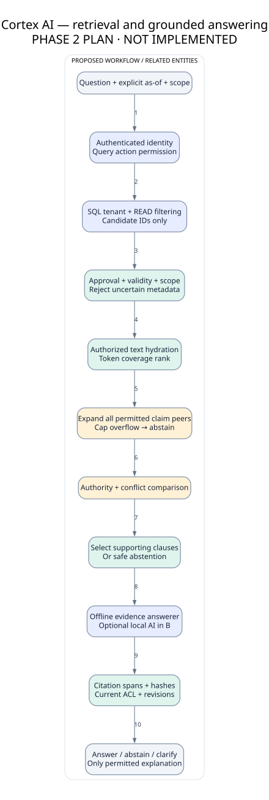

# Retrieval and reasoning explained

Retrieval means finding useful passages. Keyword search matches words, so “annual leave” finds policy clauses using those terms. Embeddings represent meaning numerically and may find paraphrases, but need a model and careful evaluation. We start with keyword matching because it runs on a CPU and is easy to inspect.

Reranking reorders candidate passages. Our first scorer uses matched query words on permitted text; it does not measure truth. Authority says which reviewed source governs a topic. A valid approved HR policy can outrank an informal note; equally authoritative valid policies with different values remain a conflict.

A citation connects a specific answer claim to a specific source span. Listing a document title is not enough: the passage must actually support the answer. If evidence is absent, unclear or contradictory, abstention means declining to provide a policy answer. This is a useful outcome, not an error hidden from the user.

There is no autonomous agent requirement. Fixed stages are easier to test. Optional agents later must improve measurable results compared with the same fixed workflow.
