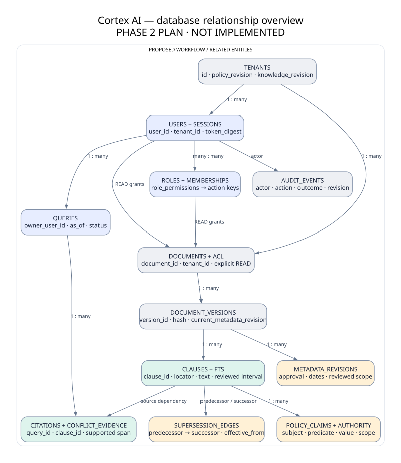

# How the database represents knowledge

**Phase3 implementation note.** The actual database has21 domain tables plus FTS5, tenant-safe keys, reviewed metadata revisions and stored query/citation dependencies. SQLAlchemy Core accesses SQLite; Alembic migrates it. Version text/hash/segments and private bytes are local, ignored by Git. The diagram below is the earlier schema plan; app/db.py is the implemented catalog. [Run and inspect](../implementation/RUN_LOCAL.md) · [actual limits](../implementation/IMPLEMENTATION_STATUS.md) · [implemented diagram](../diagrams/11-implemented-core.svg). The explanation below preserves Phase2 planned context.

---

## Preserved Phase 2 baseline

A document is a continuing policy identity. A version is one immutable file/text snapshot. A clause is a passage we can cite. Metadata revisions record reviewed changes to approval, dates and scope without rewriting the original file. A claim records a reviewed structured fact, such as annual leave = 20 working days for India full-time employees.

A validity interval says when the rule applies. A supersession edge says exactly which old clause an approved amendment replaces. Authority is the organization’s reviewed precedence rule for a topic; it is separate from approval. An audit event records who changed access or approved metadata, without copying sensitive text.

Queries store the asking user and date; citations link answer claims to evidence. Those saved outputs remain protected because they depend on document content. Missing metadata must not silently turn into permission or validity.
