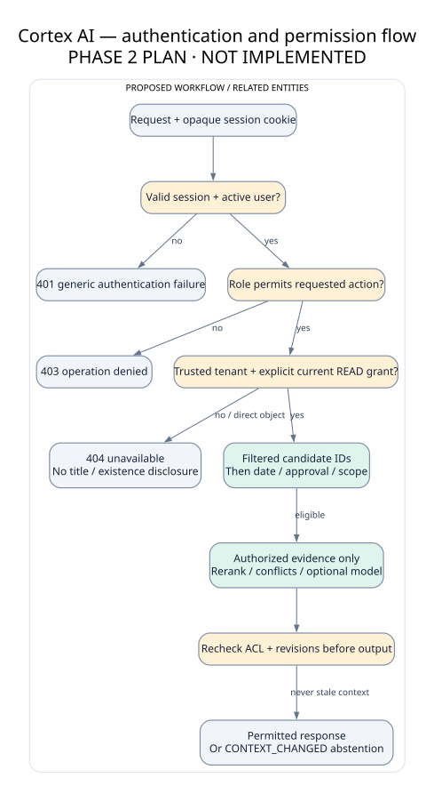

# Permissions explained with a fictional example

**Phase3 implementation note.** The implemented login uses an opaque cookie. Your roles say what actions you may perform; explicit document grants say what content you may read. Every protected request rechecks both. A single-process gate keeps access changes from committing halfway through reasoning; later history/citation reads use the new grants. It is a local control, not multiworker or production security certification. [Run and inspect](../implementation/RUN_LOCAL.md) · [actual limits](../implementation/IMPLEMENTATION_STATUS.md) · [implemented diagram](../diagrams/11-implemented-core.svg). The explanation below preserves Phase2 planned context.

---

## Preserved Phase 2 baseline

Authentication is checking that Maya signed in. Authorization is checking whether Maya may read a particular policy. A role gives permission to perform tasks; a document grant gives access to that document. An employee may ask questions without being allowed to read executive information.

For a restricted-document question, the backend searches only allowed evidence. It does not pass the restricted text to an AI and then ask the AI to hide it. It also avoids showing the hidden title or saying that a restricted document exists. The safe answer is simply that available approved evidence is insufficient.

Revocation means removing an access grant. New queries, citations and saved answers must check current grants. Text someone already downloaded cannot be erased. Historical dates do not restore old access rights. All these behaviors require implementation tests; the design is not a proof of perfect security.
