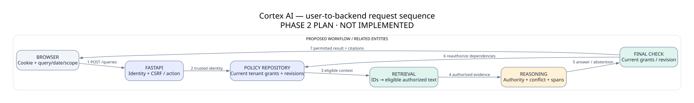

# API design

**Contract only; routes are not implemented.** Prefix `/api/v1`; JSON UTF-8, ISO dates/timestamps, opaque IDs. Same-origin cookie authentication. Every resource route enforces tenant/action/object permission; no route trusts posted identity/role/tenant. Mutations require CSRF+Origin except login requires strict Origin and rate limit.



| Method/path | Request | Response / authorization |
|---|---|---|
| POST /auth/login | email, password | 200 sets session cookie; generic 401; active tenant user; no secret in body response |
| GET /auth/session | cookie | 200 user display name, roles/action keys, CSRF token; 401; Cache-Control:no-store |
| POST /auth/logout | CSRF | 204 revoke current session |
| GET /dashboard | scope optional | 200 permitted document counts, own activity and readable unresolved conflict counts only |
| GET /documents | q, category, state, cursor, limit<=50 | 200 allowed titles/metadata only; no total across hidden docs |
| POST /documents | multipart file, title, category | 202 document/version/job IDs; upload permission; private ACL auto-grant; protected metadata rejected |
| GET /ingestion-jobs/{id} | — | 200 safe state/error, readable document required; generic 404 otherwise |
| GET /documents/{id} | — | 200 permitted metadata, versions; READ required |
| POST /documents/{id}/versions | multipart file, version_label | 202 new immutable version; upload action and document READ/ownership governance |
| GET /versions/{id}/content | locator optional | 200 escaped extracted text/spans; READ, extraction ready; no raw HTML |
| GET /versions/{id}/download | — | attachment bytes; READ, server-resolved object path, no arbitrary URL/path |
| POST /versions/{id}/review | reviewed scope, dates, source_kind, claims, expected_metadata_revision | 200 new review revision; review action+READ; 409 revision/cycle/interval conflict; publish only after all validation |
| POST /versions/{id}/approval | decision, reason, expected_metadata_revision | 200 approved/rejected revision; review action+READ; transaction increments knowledge revision |
| POST /queries | query, as_of optional, population, jurisdiction, condition_key optional | 200 typed answer/abstention/clarification; query action; no streaming A |
| GET /queries | cursor | 200 caller-owned reauthorized history summaries |
| GET /queries/{id} | — | 200 owner-only answer if all dependencies still authorized; changed dependencies → safe stale state; other owner's query generic 404 |
| GET /queries/{id}/citations/{citation_id} | — | 200 permitted span/hash/locator after ownership+READ checks |
| GET /conflicts | cursor | 200 caller-owned readable conflict pairs only; global manager overview B requires READ on both sides |
| GET /admin/users | cursor | user.manage; 200 tenant users, no hashes/session secrets |
| POST /admin/users | email, display_name, initial_role_ids | user.manage; local bootstrap password setup channel; no passwords logged |
| PATCH /admin/users/{id} | active, role_ids, expected_policy_revision | user.manage; 200; revoke/increment policy revision transaction |
| GET /admin/documents/{id}/acl | — | acl.manage+READ; 200 explicit grants |
| PUT /admin/documents/{id}/acl | complete grants, expected_policy_revision | acl.manage+READ; 200; transactional revision; prevent accidental loss of all governance access |
| PUT /admin/authority-rules/{id} | topic/scope/source_kind/rank, expected_revision | authority.manage; 200; protected governance, knowledge revision |
| GET /audit-events | date range, cursor | audit.read; 200 redacted events; no hidden title/content; user directory access separate |
| GET /health | — | public loopback safe status only, no filenames/model/tenant stats |

## Query response example — fictional expected output

```json
{
  "query_id": "demo-query-01",
  "status": "answered",
  "mode": "evidence",
  "as_of": "2026-10-09",
  "scope": {"population": "india_full_time", "jurisdiction": "IN"},
  "answer": "The approved annual leave entitlement is 20 working days per year.",
  "reason_code": null,
  "claims": [{"index": 0, "text": "20 working days per year", "citation_ids": ["cite-01"]}],
  "citations": [{"id": "cite-01", "document_id": "HR-LEAVE", "version_id": "LEAVE-2026", "clause_id": "L26-C1", "title": "Annual leave policy", "locator": "TXT line 2", "quote": "India full-time employees receive 20 working days of annual leave per year."}],
  "explanation": [{"code": "APPROVED_VALID_SOURCE", "citation_ids": ["cite-01"]}]
}
```

Internal policy/knowledge revisions, rejection lists and raw retrieval/debug scores are not public confidence or hidden-source explanations. Explanations allow APPROVED_VALID_SOURCE, HIGHER_AUTHORITY_SELECTED, HISTORICAL_RULE and EQUAL_AUTHORITY_CONFLICT only for readable cited evidence. Generic error envelope `{error:{code,message,request_id}}`; 422 validation, 413 bounds, 415 format, 409 revision mismatch, 429 rate limit, 503 safe stage unavailable. Do not expose stack trace/object storage path. User queries that abstain remain 200 domain responses.

## Idempotency, pagination and races

POST uploads use optional user-scoped Idempotency-Key with payload hash and replay-safe job result; mismatched payload →409. Duplicate content versions require explicit reviewer decision; never silently overwrite. Cursor binds tenant, user, filters and policy revision, signed by server; invalid/stale cursor →409 restart. No client SQL/FTS/ACL expression accepted. Query timeout 5 seconds evidence mode target, optional inference separate budget B; timeout produces safe failure with no partial hidden output. Exact achieved latency requires measurement.
