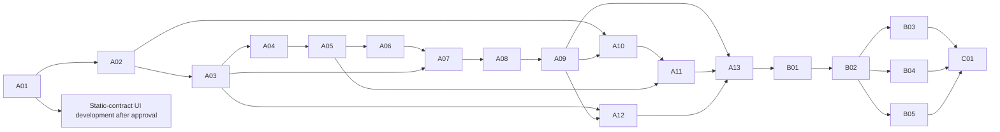

# Implementation backlog

**Nothing below has been implemented.** Priority P0=must before safe demo, P1=complete A if capacity, P2=later. Effort S≈0.5–1h, M≈1–2h, L≈2–4h focused development; estimates exclude unanticipated failures and are relative, not promises. A total approximately13–26h with reuse/parallel team work; single-developer tomorrow completion at risk.

## Milestone A — tomorrow's working MVP

| ID / priority / effort | Task and dependencies | Future files/modules | Expected behavior / acceptance | Required tests |
|---|---|---|---|---|
| A01 P0 M | Scaffold/lock local runtimes, config and migrations; deps none | backend/pyproject.toml, uv.lock; frontend/package.json, package-lock.json; app/db/, migrations/, .env.example | Fresh install, FTS5 available, loopback startup; no paid/cloud resource | Runtime smoke, schema same-tenant/interval/XOR constraints |
| A02 P0 M | Users, role actions, opaque sessions, CSRF; deps A01 | auth/, api/auth.py; tests/test_sessions.py | Active user login/logout, expiry/disable, generic failures, secure environment cookie policy | Hash/session lifecycle, Origin/CSRF, rate limit |
| A03 P0 L | Scoped repository and READ grants/revisions/gate; deps A02 | policy/, db/repositories.py, api/admin.py | Every data route same-tenant/action/explicit READ; no admin bypass; current rights on history | IDOR/tenant/resource matrix, missing grants, race/revocation, hidden metadata |
| A04 P0 M | Bounded ingestion and staging states; deps A03 | ingestion/, api/documents.py, private local-data/ | TXT first, text PDF/DOCX next; generated paths; failure/pending never searchable | Format/bounds/traversal/parser failure, one real TXT/PDF/DOCX each |
| A05 P0 M | Immutable clauses/locators, metadata review and atomic publication; deps A04 | documents/, db/models.py, migrations/ | Content/hash preserved, protected metadata reviewed, approvals/index/revisions atomic | Offsets, forged approval rejection, rollback/index consistency |
| A06 P0 S | Valid intervals and simple full-clause supersession; deps A05 | reasoning/temporal.py, documents/lineage.py | Half-open dates, explicit scope/open-ended, no upload precedence | D03,D04,D11 and cycle/interval tests |
| A07 P0 M | Filtered FTS5 IDs + permitted text scoring; deps A03,A05,A06 | retrieval/fts.py, retrieval/contracts.py | Grants before LIMIT/text, no global BM25/snippets/totals; escaped tokens | Recall fixture, hidden canary inputs, malicious MATCH syntax |
| A08 P0 M | Intent/source-kind, authority, peer expansion and typed conflicts; deps A06,A07 | reasoning/intents.py, authority.py, conflicts.py | Governing HR/ops evidence required; strongest conflict abstains; peer overflow safe | D05,D06,D10, note-only revocation, no conflict across dates/scopes |
| A09 P0 M | Offline evidence answer/citation/support contract; deps A08 | answers/, api/queries.py | Answer/abstain/clarify typed states; spans/hash and final revision recheck | D01,D07,D09, invented citation/support failure |
| A10 P0 M | UI shell/login/assistant/evidence/library; deps A02,A09 API contracts; layout can start after A01 | src/app/, pages/, components/, api/ | Real session, date/scope, source opening, empty/conflict/error states; zero static answer substitution | Vitest state/accessibility basics; E2E login-query-citation |
| A11 P1 M | Upload/detail/review and minimal permissions UI; deps A03,A05,A10 | pages/Upload, DocumentDetail, AdminPermissions | Reviewer approves; admin updates grants; pending/future labels; generic denied content | E2E upload-review, D08 revocation, version/source checks |
| A12 P0 S | Minimal safe dashboard/activity audit; deps A03,A05,A09 | audit/, api/dashboard.py, pages/Dashboard | Only visible counts and own activity; sanitized auditor view | Hidden-count/title/log canaries, event atomicity |
| A13 P0 M | Seed fictional corpus + run whole gate/demo; deps A06–A12 | scripts/seed_demo.py, evaluation/, frontend/e2e/demo.spec.ts | Same fixture hashes, generated local credentials, D01–D12 results and named failures; p50/p95 measured | All MVP acceptance gates, zero unauthorized stage/payload observations |

P1 affects polished administration/review UI, not underlying grant/review enforcement: if UI incomplete, a documented local operator CLI may perform governance but must exercise the same validated service. Mark missing UI gate partial. Never move A03 or citation checks behind polish.

## Milestone B — strong evaluated core

| ID / priority / effort | Task and dependencies | Files/modules | Expected behavior / acceptance | Tests |
|---|---|---|---|---|
| B01 P1 L | Clause-level partial amendments, metadata revision history, exact exceptions; A13 | documents/lineage.py, reasoning/scope.py, migrations/ | Unchanged clauses retain validity; cycles/ambiguous exception overlap refused | Partial amendment, retroactive, narrower/broader exception strata |
| B02 P1 L | Expand benchmark and human labels; A13,B01 | evaluation/corpus/, labels/, reports/ | Policy-family splits, label disagreement log, failure strata/CIs | Schema/hash/split leakage checks, deterministic repeats |
| B03 P2 L | Local embeddings/hybrid+RRF; B02 | retrieval/vector.py, fusion.py; model manifest | Identical ACL filters; held-out recall gain at measured RAM/latency | Unauthorized semantic canary, relevance ablation, stale index |
| B04 P2 L | Optional NLI detector; B02 | reasoning/nli.py, evaluation/conflicts/ | Beats structured baseline on prose without unacceptable false alarms | Domain/exception negatives, precision/recall/calibration |
| B05 P2 L | Local generator/support adapter; A09,B02 | answers/local_model.py, verification.py | No external dependency; source-limited output; exact support failures abstain | Prompt/fact injection, citation entailment human review, resource timeout |
| B06 P1 M | Complete secondary screens, dark theme, accessibility; A11,A12 | pages/Conflicts, Activity, AdminUsers, components/tokens | Full navigation/keyboard/source review, no hidden pair/count leak | Responsive, focus, WCAG checks, role route matrix |
| B07 P1 M | Governance separation, retention and backup/restore; A13 | audit/, admin/, maintenance/, migrations/ | Author cannot self-approve when enabled; reauth retained outputs; backup consistent | Role separation, retention dependency handling, restore integrity |

## Milestone C — advanced capabilities admitted by measurement

| ID / priority / effort | Task and dependencies | Files/modules | Acceptance | Tests |
|---|---|---|---|
| C01 P2 L | Bounded read-only retrieval planner; B02–B05 | orchestration/, evaluation/agents/ | Quality gain vs fixed stages within agreed latency/call budget; no privilege/tool expansion | Same-filter agent ablation, injection/tool escape, call/time budget |
| C02 P2 L | PostgreSQL/multi-process/tenant deployment; B07 | db/adapters/, deployment/, migration ADR | Shared revocation consistency and tenant tests pass before hosting | Multiworker revocation, RLS/application predicate parity, load/backups |
| C03 P2 L | Connector ACL sync/chunk access; B07,C02 | connectors/, policy/chunks.py | Source identity parity, fail-closed stale ACL and intersection inheritance | Mixed-section protection, propagation/revocation, summaries/embeddings |
| C04 P2 M | Optional Docker packaging and observability; A13 or later | deployment/, sanitized telemetry | Reproducible local image with no secrets/public default ports | Image/config scans, bounded resource/health checks |

## Dependencies and independent tracks

Critical path: A01→A02→A03→A04→A05→A06→A07→A08→A09→A13; UI integration joins at A10/A11. Frontend layout/components and fixture/test preparation can be worked on independently against frozen contracts after approval; this is a work allocation suggestion, not agent delegation or work already performed.
