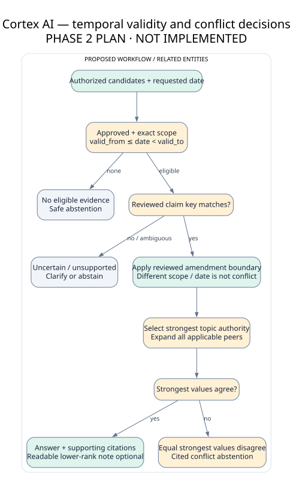

# Retrieval, temporal reasoning and answer contract

**Initial implementation plan · 2026-10-09.** A is retrieval plus deterministic evidence answering; fluent generative RAG is optional B. It must be labeled “Evidence answer” in the UI, not falsely advertised as a running LLM.

| Stage | Receives | Returns / fail-closed behavior |
|---|---|---|
| 1 Authenticate | session cookie, request context | server Identity(user, tenant, current roles); 401 on invalid |
| 2 Authorize query | Identity, query.execute action | EligibilityContext(policy_revision, knowledge_revision); 403 action failure |
| 3 Normalize intent | query <=1000 chars, explicit as_of and scope | normalized tokens, topic/predicate, date/population/jurisdiction; unsupported/ambiguous → clarification |
| 4 Permission-aware candidate search | trusted context, escaped FTS query | IDs only joined through current tenant/grants; no unrestricted snippet/text; no LIMIT before grants |
| 5 Date/scope/approval eligibility | candidate IDs and reviewed metadata | approved indexed IDs with `from<=as_of<to` and exact scope; missing metadata excluded safely |
| 6 Retrieve and rank | eligible IDs | hydrate permitted text, score distinct token coverage; top 20 candidates; no shared-corpus BM25 score exposed |
| 7 Authority and peer expansion | matched reviewed claim key + permitted context | all approved applicable peers for exact scope/subject/predicate/unit/condition key, independent of top-k; cap 100 peers then abstain on overflow |
| 8 Compare conflicts | authorized peers + reviewed lineage/claims | agreed strongest value, lower-authority disagreement or unresolved conflict; unknown rule/scope → abstain |
| 9 Select evidence | decision and candidate relevance | <=8 authorized clauses and claim-to-span mappings, or no-context abstention |
| 10 Answer | selected AuthorizedEvidence only | structured value sentence with quote/citation; extractive fallback for bounded nonnumeric lookup; optional local adapter B |
| 11 Verify | answer claims/citation IDs/spans/hashes + current revisions | exact structured support and source hash; mismatch → SUPPORT_FAILED or CONTEXT_CHANGED |
| 12 Publish | reauthorized dependencies | typed response + permitted explanations; owner-only history, redacted audit event |

Literal FTS tokens are quoted/escaped and parameterized; user query is not an arbitrary MATCH expression. Empty tokens or overly broad query asks for clarification. Candidate scoring is a heuristic, not probability of truth. Known A intents: annual leave entitlement, remote-work days per week, notice period and approval-contact lookup, using explicit finite synonym mappings. Arbitrary enterprise/legal QA is outside the demonstrated coverage.

Policy-entitlement intents also require the reviewed governing source kind (HR for leave/notice, operations for remote work). Informal notes may be readable comparison evidence but cannot alone support a policy answer. Missing governing evidence causes generic NO_ELIGIBLE_EVIDENCE; this avoids promoting an informal note after an authoritative document is revoked.

## Temporal and conflict rules

The as-of date asks what approved rule applied then, using evidence known now and current access rights. “What was known then?” transaction-time reconstruction is not supported A. Tenant timezone Asia/Kolkata; dates do not depend on UTC midnight. Default date is backend local policy date, always displayed. Client date must be ISO date, not “last Friday”; ambiguous natural dates require clarification.

Approval, source_kind and authority are protected governance metadata. Compare authority only within the same reviewed claim key: topic + subject + predicate + population + jurisdiction + unit + modality + condition_key. Choose greatest active topic authority rank among applicable claims. If strongest claims agree, return value and cite agreement. Show lower-authority disagreement only when readable and relevant, without turning an informal note into policy. If strongest simultaneously applicable claims disagree, abstain with both permitted citations. Never average leave days or choose by upload time.

An amendment is a reviewed successor edge closing the predecessor interval at the effective boundary. Exception has a reviewed narrower condition and `exception_of`; A supports only exact known condition keys and asks for clarification otherwise. Different populations, dates or units are not automatically contradictions. Missing claim annotation or unresolved broad/narrow applicability → UNCERTAIN_METADATA. A does not detect arbitrary prose contradictions.

Peer expansion avoids conflict invisibility from top-k: once “annual_leave_days” is recognized, inspect every eligible peer of that exact key even if its wording lacks query keywords. Measure peer coverage separately; it cannot guarantee discovery when intent/metadata is wrong.

## Response and abstention states

`status`: answered | abstained | clarification_required. `reason_code`: null | NO_ELIGIBLE_EVIDENCE | UNRESOLVED_CONFLICT | UNCERTAIN_METADATA | UNSUPPORTED_INTENT | SUPPORT_FAILED | CONTEXT_CHANGED | EVIDENCE_LIMIT. A safe no-evidence message: “I cannot answer from the available approved evidence for this date and scope.” It does not disclose whether restricted evidence exists.

Citation = clause/version/document ID + verified text span + locator + current source hash. Backend builds displayed source titles/URLs after authorization; model output cannot invent IDs or arbitrary links. One factual claim maps to one or more supporting spans. The reader opens a source pane at the exact quote; page number only when parser has page mapping. DOCX/TXT use paragraph/line locators. Metadata approval is separately identified from evidence text.

## Optional enhancements and measurable admission gate

Retriever, ranker, conflict detector and answerer expose typed interfaces. B may add embeddings+RRF, local NLI and local generation against the same permission/date rules. Compare lexical vs hybrid recall at equal eligible corpus, rule vs NLI conflict F1/false positives, extractive vs generated citation support and selective accuracy, latency/RAM. Automatic citation entailment is probabilistic and needs human labels. ReAct-style agents C require an ablation against this fixed pipeline, bounded read-only calls and evidence of quality benefit exceeding added cost.

Prior work: [BEIR](https://arxiv.org/abs/2104.08663), [TimelyRAG](https://arxiv.org/abs/2609.11572), [Ragability](https://aclanthology.org/2026.lrec-1.182/), [ALCE](https://arxiv.org/abs/2305.14627). These support test choices; they do not establish Cortex performance.
