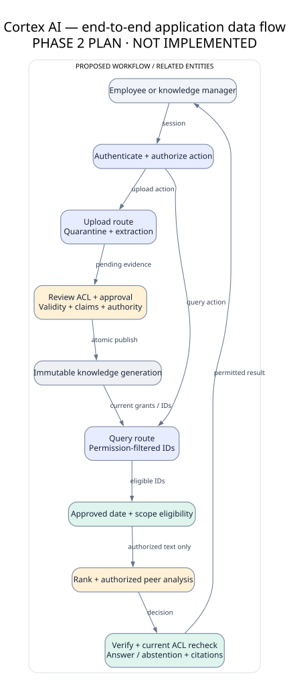
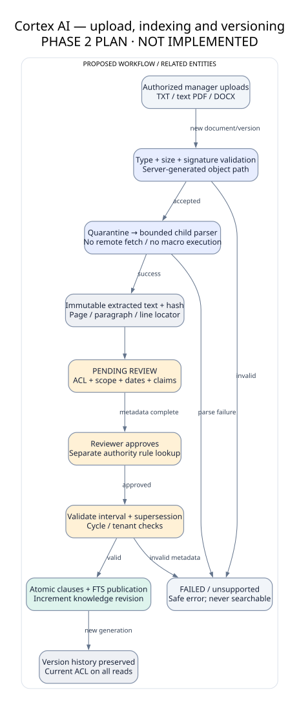
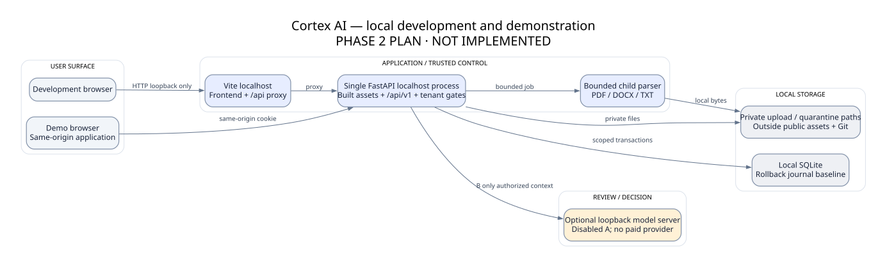

# System architecture

**Proposed implementation architecture · Phase 2 · 2026-10-09.** All services below are planned. Static designs and documentation are the only artifacts currently created.

The browser asks one FastAPI application. That application owns identity, evidence eligibility and final authorization; optional AI adapters have no database credentials or permission-changing tools. Blue = application, teal = permitted evidence, amber = review/decision, grey = storage. See [diagram index](../DIAGRAMS.md) for editable sources and explanations.

## Modules and connections

| Module / future location | Responsibility | Receives → returns |
|---|---|---|
| `backend/app/auth/` | Password verification, session lifecycle, CSRF | Cookie + CSRF → trusted Identity or 401/403 |
| `backend/app/policy/` | Role actions, tenant/doc ACL, policy revision | Identity + action + object → allow/deny |
| `backend/app/ingestion/` | Quarantine, bounded subprocess parsing, hashes, review | Authorized upload → pending version/job |
| `backend/app/documents/` | Metadata approvals, immutable versions/clauses, lineage | Reviewed draft → published index generation |
| `backend/app/retrieval/` | Filtered IDs then authorized text; bounded scoring | Query + EligibilityContext → AuthorizedEvidence[] |
| `backend/app/reasoning/` | Validity, scope, authority, structured conflicts | AuthorizedEvidence + reviewed claims → Decision |
| `backend/app/answers/` | Extractive answer, citation validation, abstention | Decision → typed answer, claim-span citations |
| `backend/app/audit/` | Minimal events and sanitized inspection | Action outcome → event; never raw hidden content |
| `backend/app/db/` | Transactions, scoped repositories, migrations | Trusted context → relational data |
| `frontend/src/` | Session UI, assistant, documents, admin, evidence viewer | Typed API responses → accessible screens |
| `evaluation/` | Fictional corpus labels, metrics, matched variants | Frozen data + pipeline variant → report |

Directories describe Phase 3 placement; they are not scaffolded in Phase 2.

## Request and ingestion boundaries

Queries read an approved immutable evidence generation. Uploads enter a separate staging area and cannot silently enter answers. Ingestion can inspect restricted bytes as a privileged internal parser; it is not an end-user AI stage and does not send bytes to external services.

State machine: quarantined → extracting → pending_review → indexed; failures → failed. Publication requires metadata review and approval transaction. Files and text are immutable after extraction; corrections create a new version or append a metadata revision. A document may have several simultaneously valid versions; overlap is not automatically an error because it may reveal conflict.

## Concurrency and revocation

One backend process initially. Every query captures tenant `policy_revision` and `knowledge_revision`. Any ACL, membership, approval, authority, scope, interval or lineage change increments the relevant revision transactionally. AI stages receive only authorized evidence. Before dispatch to an optional model, check revisions under a per-tenant read gate. Mutations acquire the write gate. The gate prevents a revocation from committing while an evidence-consuming stage is in flight; already disclosed evidence cannot be recalled. Recheck revisions and ACLs before response publication; changed state returns safe `CONTEXT_CHANGED` abstention. No streaming or answer cache in A. A multi-process deployment requires a shared consistency design before approval; an in-process lock is insufficient there.

## Local deployment

Development browser → Vite loopback proxy → FastAPI loopback. Demo browser → FastAPI serves built frontend and `/api/v1`, same origin. SQLite, quarantine and uploads remain outside public assets and Git. Parser runs in a child process with size/time bounds; this is containment, not a hardened OS sandbox. Model endpoint is optional, loopback-only and disabled. No Docker or cloud provisioning now.

## Research justification and limits

[Phase 1 architecture notes](../ARCHITECTURE_NOTES.md) remain historical observations. We adopt authorized retrieval from [Amazon Q's documented flow](https://docs.aws.amazon.com/amazonq/latest/qbusiness-ug/how-it-works.html), separate citation support from presence following [ALCE](https://arxiv.org/abs/2305.14627), and explicit validity rather than newest-upload preference in light of [TimelyRAG](https://arxiv.org/abs/2609.11572). We do not claim access to proprietary internal implementations or validated Cortex results.
