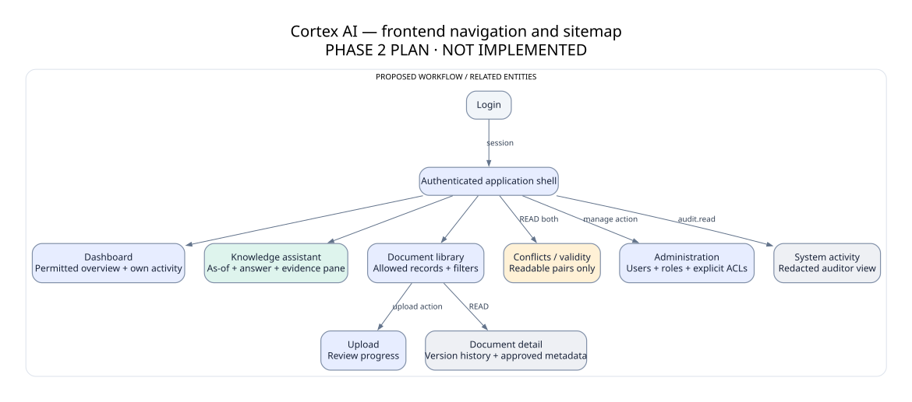

# Frontend navigation and experience plan

**Original Cortex design concepts; no functional application.** The proposed direction is **Evidence Studio**: an ink navigation rail, warm white work surface, restrained teal actions, precise typography and an always-available evidence pane. Two alternatives are documented for review; this recommendation does not authorize implementation.

| Page / future route | Layout and important states | Allowed operations |
|---|---|---|
| Login /login | Compact labeled form, product identity, generic error, loading/lockout | Sign in; no public signup |
| Dashboard / | Greeting, ask field, permitted knowledge summary, own activity, readable review/conflict links | Only counts of visible data; no global hidden source totals |
| Assistant /assistant | Question and date/scope controls; answer center; source pane right; follow-up composer | Evidence answer / conflict / insufficient / clarification / context changed; no false confidence percent |
| Library /documents | Search/filter toolbar, sortable permitted rows, validity/approval labels | Inspect; upload action shown if allowed; cursor pagination |
| Upload /documents/upload | File limits, private ACL explanation, progress state, review form | Upload→pending→review→approve; errors readable; protected metadata assigned in reviewer stage |
| Detail /documents/:id | Title, source viewer, date/approval/authority summary, vertical version history | Readable versions only; exact citation locator; governed review actions |
| Conflicts /conflicts | Topic/date/scope, two permitted passages, explicit unresolved status | No invented resolution; manager review link; new approved amendment is separate governance action |
| Admin /admin/users and /admin/permissions | Users/roles table, distinct action permissions and document READ matrix | Grant/revoke preview and confirmation; no checkbox implying admin universal READ |
| Activity /activity | Time/action/actor/outcome, sanitized filters | Auditor-only global activity; employee own events only |

## Components and response states

AppShell, navigation rail/mobile drawer, PageHeader, date/scope toolbar, QueryComposer, AnswerState, ClaimWithCitation, EvidencePane, SourceLocator, StatusBadge, PolicyTimeline, DocumentTable/mobile rows, UploadStepper, ACLGrantEditor, InlineError, EmptyState and AccessibleDialog. Specifications and tokens: [design system](../design/DESIGN_SYSTEM.md), [components](../design/UI_COMPONENTS.md). All content displayed as escaped text; unsupported document HTML never rendered.

The assistant must display requested date and scope beside every answer. Citations open a pane with exact supporting passage and source state, not a marketing link. Conflict answers show both values with supporting evidence and say no definitive answer is available. Missing evidence is generic and never lists restricted documents. History refresh rechecks dependencies; revoked evidence hides the saved answer.

## Responsive and accessibility behavior

Desktop 1440/1280: 224 px rail, 24–40 px workspace gutters, assistant 2-column content/evidence. Tablet below1024: smaller rail, evidence drawer. Mobile390: full-width workspace, hamburger navigation, answer then expandable evidence, tables become stacked rows; date/scope wrap vertically. No page-width horizontal scroll; deliberate source text scroll only if necessary. Minimum44 px touch targets, body16/14px, visible keyboard focus, skip link, labeled form fields, live status for upload/answer completion. Target WCAG2.2 AA; contrast measured for token pairs in design review, complete app audit later.

Microinteractions: 120–160ms color/opacity changes, source focus/scroll, no decorative animation. Respect prefers-reduced-motion. Light theme primary A; dark theme token specification B without delaying required screens. Native/system font fallback guarantees offline availability; no font CDN required.

## Visual deliverables and limitation

[Design gallery](../design/README.md) contains moodboard, three directions, dashboard/assistant/library concept previews, mobile adaptations and secondary wireframes. HTML/CSS is a static planning artifact with nonfunctional controls labeled accordingly. Concept PNGs are rendered SVG artwork, **not browser screenshots**. The in-app browser timed out on local preview and Chrome control was unavailable; owner declined headless Playwright. Preserve sources, document the limitation and verify actual browser screenshots in Phase 3.
